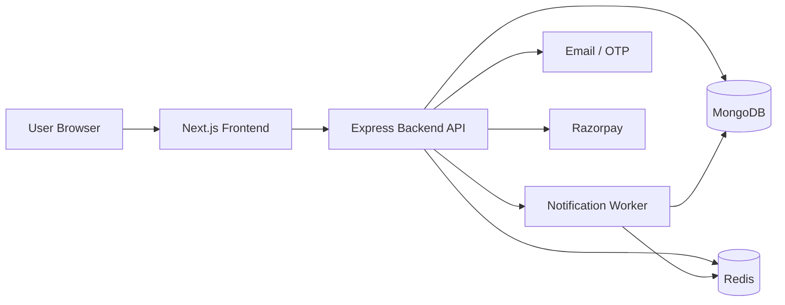
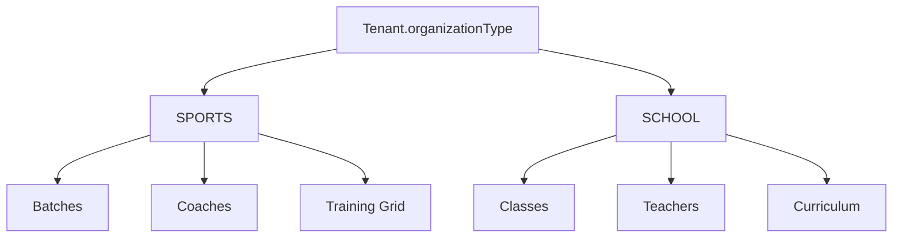
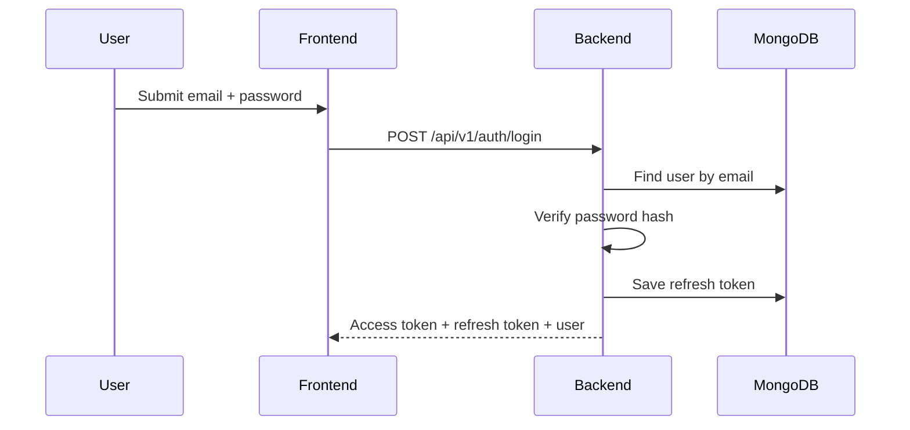
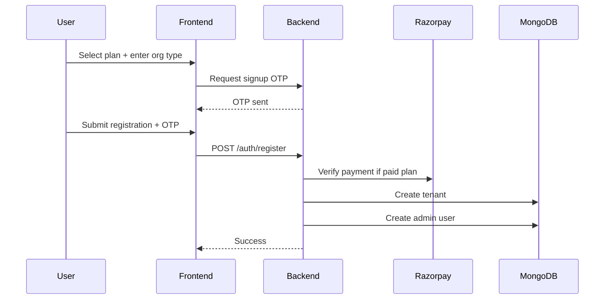

# ArenaPilot OS Architecture Overview

This document is the fast onboarding reference for developers working on ArenaPilot OS.

It explains:
- system structure
- core modules
- tenant and org-type behavior
- main data relationships
- critical request flows
- suggested documentation practice for future changes

## 1. Product Summary

ArenaPilot OS is a multi-tenant SaaS platform that currently supports two organization modes:

- `SPORTS`
- `SCHOOL`

The same product shell is reused for both, but feature access and labels change based on `tenant.organizationType`.

Examples:
- `SPORTS`: Batches, Coaches, Training Grid
- `SCHOOL`: Classes, Teachers, Curriculum

## 2. High-Level System Design



## 3. Runtime Components

### Frontend
- Framework: Next.js
- Main dashboard shell: `frontend/app/dashboard/page.tsx`
- Auth pages:
  - `frontend/app/login/page.tsx`
  - `frontend/app/register/page.tsx`

### Backend
- Framework: Express
- Entry point: `backend/src/server.js`
- App wiring: `backend/src/app.js`

### Data Layer
- Primary database: MongoDB
- Cache / queue infra: Redis
- Background jobs: BullMQ worker

## 4. Repository Structure

```text
arena-pilot-os/
  backend/
    src/
      bootstrap/
      config/
      middleware/
      models/
      modules/
      utils/
      validators/
      workers/
  frontend/
    app/
      dashboard/
      login/
      register/
    lib/
  docs/
```

## 5. Backend Module Map

### Platform and Auth
- `auth`
  - login
  - registration
  - OTP
  - refresh token
  - `/auth/me`
- `admin`
  - super admin controls
  - tenant management
  - platform plan controls

### Tenant and Billing
- `tenant`
  - tenant features
  - subscription summary
  - tenant payment views
- `billing`
  - tenant plan activation
  - pricing
  - payment snapshots
- `fees`
  - fee plans
  - student fee assignment
  - pending fees

### Sports / School Operations
- `batches`
  - sports classes / groups
- `classes`
  - school class management
- `teachers`
  - school teacher records
- `students`
  - shared student system
- `attendance`
  - shared attendance system
- `subjects`
  - school curriculum subjects
- `team`
  - access users / staff / coach-style access accounts

### Supporting Modules
- `notifications`
- `automations`
- `dashboard`
- `integrations`

## 6. Multi-Tenant Design

Every important business record is tenant-scoped.

Typical tenant-scoped models:
- `Tenant`
- `User`
- `Student`
- `Batch`
- `Class`
- `Teacher`
- `Subject`
- `Attendance`
- `Subscription`
- `Payment`

Tenant isolation is enforced through:
- auth middleware
- tenant middleware
- tenant context middleware
- repository-level tenant filters

## 7. Organization Type Design

`Tenant.organizationType` drives both UI and backend route behavior.



### SPORTS Mode
- uses `batchId`
- uses coach-oriented labels
- sports-specific routes enabled

### SCHOOL Mode
- uses `classId`
- uses teacher-oriented labels
- school-specific routes enabled

## 8. Route Gating

Middleware:
- `backend/src/middleware/checkOrgType.js`

Expected behavior:
- `SPORTS` tenants cannot access school-only routes like:
  - `/classes`
  - `/teachers`
  - `/subjects`
- `SCHOOL` tenants cannot access sports-only routes like:
  - `/batches`
  - coach-specific flows

## 9. Shared vs Separate Domain Logic

### Shared
- auth
- billing
- fee plans
- student records
- access control users
- attendance engine

### Sports-specific
- batches
- coach assignment
- training-style schedule data

### School-specific
- classes
- teachers
- curriculum / subjects
- class-teacher-student linking

## 10. Core Data Relationships

```mermaid
erDiagram
  TENANT ||--o{ USER : has
  TENANT ||--o{ STUDENT : has
  TENANT ||--o{ BATCH : has
  TENANT ||--o{ CLASS : has
  TENANT ||--o{ TEACHER : has
  TENANT ||--o{ SUBJECT : has
  TENANT ||--o{ ATTENDANCE : has
  TENANT ||--o{ SUBSCRIPTION : has

  CLASS ||--o{ STUDENT : contains
  TEACHER ||--o{ CLASS : assigned_to
  CLASS ||--o{ SUBJECT : offers
  TEACHER ||--o{ SUBJECT : teaches

  BATCH ||--o{ STUDENT : contains
  USER ||--o{ BATCH : coaches

  STUDENT ||--o{ ATTENDANCE : has
  BATCH ||--o{ ATTENDANCE : sports_scope
  CLASS ||--o{ ATTENDANCE : school_scope
```

## 11. Important Models

### Tenant
Key fields:
- `name`
- `academyCode`
- `ownerName`
- `organizationType`
- `planName`
- `tenantStatus`
- `subscriptionStatus`

### User
Used for:
- login accounts
- access users
- admin / staff / coach-style roles

### Student
Shared across both org types.

Important fields:
- `tenantId`
- `batchId` for sports
- `classId` for school
- `rollNumber` for school
- `feeStatus`

### Class
School model.

Important fields:
- `tenantId`
- `name`
- `section`
- `classTeacherId`
- `strength`

### Teacher
School model.

Important fields:
- `tenantId`
- `name`
- `email`
- `phone`

### Subject
School model.

Important fields:
- `tenantId`
- `name`
- `classId`
- `teacherId`
- `status`

## 12. Main Request Flows

### Login Flow



### Registration Flow



### School Class Assignment Flow
- create teacher or access-user-backed teacher
- create class
- assign teacher to class
- assign student to class
- attendance uses `classId`

### Sports Batch Flow
- create batch
- assign coach
- add students to batch
- attendance uses `batchId`

## 13. Current Frontend Reality

The backend is modular.

The frontend still has one major hotspot:
- `frontend/app/dashboard/page.tsx`

This file contains:
- dashboard shell
- academy-pro panels
- student forms
- access control UI
- many org-type branches

Recommended future refactor:
- extract school/student/access/finance sections into dedicated components
- keep `page.tsx` as orchestration only

## 14. Known Architectural Rules

### Rule 1
Do not mix `batchId` and `classId` logic blindly.

### Rule 2
Any new feature touching operations must decide:
- sports-only
- school-only
- shared

### Rule 3
Whenever UI labels change by org type, use:
- `frontend/app/dashboard/label.helper.ts`

### Rule 4
Whenever route access changes by org type, use:
- `checkOrgType()`

### Rule 5
For school teacher assignment, remember there are two concepts:
- school `Teacher` records
- access users that may also need to behave like teachers in UI flows

## 15. Super Admin Responsibilities

Super admin currently controls:
- tenant creation/editing
- tenant organization type switching
- pricing
- platform plans
- integrations

Important caution:
- switching tenant `organizationType` changes app behavior
- existing tenant data is not automatically migrated between sports and school domain models

## 16. Suggested Future Documentation Practice

For every major feature, update:

1. `docs/architecture-overview.md`
2. relevant module README or markdown note
3. API examples if request/response changed

Recommended future docs to add:
- `docs/api-map.md`
- `docs/data-models.md`
- `docs/sports-vs-school.md`
- `docs/developer-onboarding.md`

## 17. Recommended Draw.io Boards

If you later create Draw.io diagrams, keep these files:

- `docs/system-design.drawio`
- `docs/data-relations.drawio`
- `docs/sports-vs-school.drawio`

Recommended pages inside Draw.io:
- overall architecture
- backend modules
- school flows
- sports flows
- DB relationships

## 18. Fast Onboarding Checklist For New Developers

Read in this order:

1. `README.md`
2. `docs/architecture-overview.md`
3. `backend/src/server.js`
4. `backend/src/app.js`
5. `frontend/app/dashboard/page.tsx`
6. `frontend/app/dashboard/label.helper.ts`
7. org-specific backend modules:
   - `classes`
   - `teachers`
   - `subjects`
   - `batches`
   - `attendance`

## 19. Change Safety Checklist

Before shipping feature changes, ask:

- Is this sports-only, school-only, or shared?
- Does this need `organizationType` label changes?
- Does this need route gating?
- Does this need tenant-scoped queries?
- Does this affect student assignment or attendance scope?
- Does it require frontend + backend alignment?

---

This file should be treated as the living architecture reference for ArenaPilot OS.
